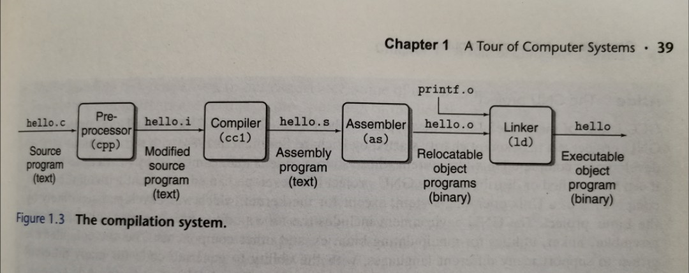

[TOC]

# 编译过程

借用一图片来自csapp第一章

## 1. 预处理

- 输入：c源码(.c .h.cpp  )
- 处理：解析include，define，ifdef等预编译选项
- 输出：修改过的源码.i
- 工具： cpp

## 2. 编译

- 输入：预处理之后的源码
- 处理：转换为特定机器的汇编代码
- 输出：汇编代码.s，文本格式
- 工具：cc1

## 3. 汇编

- 输入：汇编源码
- 输出：目标文件(.o)

## 4. 链接

- 输入：目标文件(.o)，库文件(.so 或.a)
- 输出：可执行二进制文件，或者动态链接库文件(.so)
- 命令：ld
- 默认输出可执行文件
- 加-shared选项可以输出.so

## 5. 库文件

**动态库(.so)**

- 输入：目标文件(.o)
- 使用ld -shared

**静态库(.a)**

- 输入：目标文件(.o)
- 命令：ar

# 一些常用工具

- file : 查看文件类型
- size：查看段大小（text、data、bss）
- ldd : 查看程序依赖哪些库
- nm：查看ELF文件的符号信息，可以看到函数名和全局变量名称
- strip：去除elf文件的符号信息，一般在正式发布时用力减小可执行文件大小
- objdump：可以进行反汇编处理
- readelf：显示ELF文件信息

# 推荐阅读

- [Computer Systems: A Programmer's Perspective](https://csapp.cs.cmu.edu/)
- [编译和链接那点事](https://mp.weixin.qq.com/s/4MauRFB3ogm8vhLpr1oP9g)
